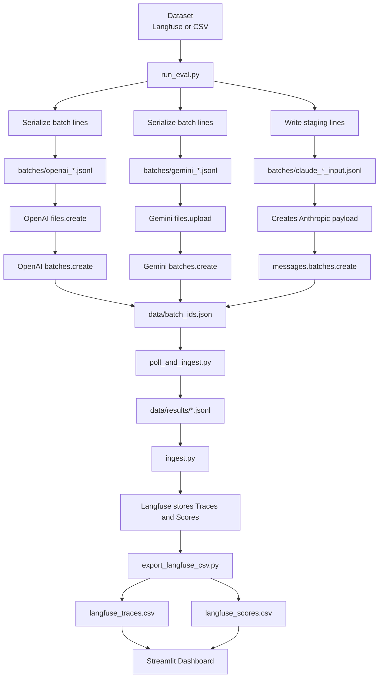

# LLM Batch Evaluation — Model Drift & Quality Monitoring

Automated weekly evaluation of LLM models (OpenAI, Gemini, Claude) against a ground-truth dataset, with drift monitoring via [Langfuse](https://langfuse.com) and a [Streamlit dashboard](https://llm-eval-dashboard.streamlit.app/).

This repository is the public code and reproducibility repository for the thesis workflow. It owns the batch-evaluation pipeline, Langfuse export logic, prompt-optimisation code, frozen reproducibility inputs, and the canonical evidence rebuild. The manuscript source and publication-ready thesis assets belong in the separate manuscript repository [`GeorgiiBurdinComo/statistical-drift-detection-thesis`](https://github.com/GeorgiiBurdinComo/statistical-drift-detection-thesis).

---

## Repository boundary

This repository contains:

- evaluation runtime code under `scripts/`, `config/`, and `streamlit_app/`
- prompt-optimisation code under `prompt_optimization/`
- tests for the pipeline and supporting analysis
- frozen reproducibility inputs such as `streamlit_app/langfuse_traces.csv`, `streamlit_app/langfuse_scores.csv`, and the split files under `prompt_optimization/splits/`
- canonical evidence exports under `notebooks/canonical_evidence_export/`

This repository does not need local caches, notebook debris, IDE metadata, or temporary render outputs for publication. Those should stay ignored or be removed before release.

## Committed reproducibility artifacts

Some generated files stay committed because they are rebuild inputs for the thesis evidence:

- `streamlit_app/langfuse_traces.csv`
- `streamlit_app/langfuse_scores.csv`
- `prompt_optimization/splits/train.json`
- `prompt_optimization/splits/val.json`
- `prompt_optimization/splits/test.json`
- `prompt_optimization/splits/split_manifest.json`
- `notebooks/canonical_evidence_export/`
- selected GEPA run summaries and metric histories, without exact prompt text

These files support repository-local regeneration of the published tables and figures without making paid provider API calls.

Exploratory notebooks and chart-history dumps are intentionally excluded from the public branch unless they are needed as frozen reproducibility artifacts.
Exact prompt text artifacts from GEPA runs are intentionally excluded from the public branch; the public surface keeps run summaries, metric histories, and candidate-level scores instead.

## Replay boundary

This repository can replay the thesis evidence from frozen local artifacts and can rerun the current pipeline against external providers. Exact historical replay still depends on provider-side model behaviour, archived request settings, and the stored manifests available for a given run.

---

## How it works

The pipeline runs in three stages:

1. **Submit** — `run_eval.py` loads a labeled eval dataset from Langfuse (or CSV), writes per-provider batch **input JSONL** under `batches/` (one file per model), then uploads those files and submits asynchronous batch jobs to OpenAI, Gemini, and Claude Batch APIs. Outputs a manifest (`data/batch_ids.json`).
2. **Retrieve & Ingest** — `poll_and_ingest.py` polls each provider until batches complete, downloads result JSONL, then scores every prediction against ground truth. Traces, generations, and scores (`accuracy`, `error_type`, `cost_usd`) are written to Langfuse.
3. **Dashboard** — `export_langfuse_csv.py` writes two snapshots under `streamlit_app/`: `**langfuse_traces.csv`** (rows from `GET /api/public/traces` — trace ids, tags, metadata, fields the app joins on) and `**langfuse_scores.csv**` (rows from `GET /api/public/v2/scores` — `accuracy`, `error_type`, `cost_usd`, etc., keyed to observations). The Streamlit app loads both and renders accuracy trends, cost breakdowns, and per-model comparisons.




---

## Quickstart

**First:** choose what to evaluate and what data to use.

- **Models** — edit `[config/models.yaml](config/models.yaml)` (`openai` / `gemini` / `claude` lists). Optional: pass `--models gpt-5,claude-sonnet-4-6` on submit to run a subset without changing the file.
- **Dataset** — pass `--langfuse-dataset <name>` for a Langfuse dataset, or `--csv path/to.csv` for a local file. Use the **same** source when you run `poll_and_ingest.py` so ground-truth labels match.

```bash
# 1. Install
pip install -r requirements.txt

# 2. Set up .env (see Configuration below)

# 3. Submit batches (models + dataset as above)
python scripts/run_eval.py \
  --langfuse-dataset YOUR_DATASET \
  --batch-ids data/batch_ids.json \
  --run-id local-001

# 4. Retrieve results & ingest (run after batches complete)
python scripts/poll_and_ingest.py \
  --batch-ids data/batch_ids.json \
  --run-id local-001

# 5. Export & launch dashboard
python streamlit_app/export_langfuse_csv.py
streamlit run streamlit_app/app.py
```

---

## Configuration

### API keys (`.env`)

```
OPENAI_API_KEY=...
GOOGLE_API_KEY=...
ANTHROPIC_API_KEY=...
LANGFUSE_PUBLIC_KEY=...
LANGFUSE_SECRET_KEY=...
```

### Models (`config/models.yaml`)

Lists which models to evaluate per provider, plus batch-API pricing (per 1M tokens) used to compute `cost_usd` scores:

```yaml
# Models to benchmark
# Pricing: BATCH API prices per 1M tokens (USD)
# Source: https://developers.openai.com/api/docs/pricing?latest-pricing=batch
#         https://ai.google.dev/gemini-api/docs/pricing (Batch section)
#         https://platform.claude.com/docs/en/about-claude/pricing
# Last updated: 2026-03-09

openai:
  - gpt-5.4
  - gpt-5.2
  - gpt-5.1
  - gpt-5
  - gpt-5-mini
  - gpt-5-nano
  - gpt-4.1-mini
  - gpt-4.1-nano

gemini:
  - gemini-2.5-flash


claude:
  - claude-sonnet-4-6
  - claude-sonnet-4-5
  - claude-haiku-4-5


# Batch API pricing per 1M tokens (USD)
pricing:
  # --- OpenAI (batch prices) ---
  gpt-5.4-2026-03-05:      {input: 1.25,  output: 7.50}
  gpt-5.4:                 {input: 1.25,  output: 7.50}
  gpt-5.2:                 {input: 0.875, output: 7.00}
  gpt-5.2-pro:             {input: 10.50, output: 84.00}
  gpt-5.1:                 {input: 0.625, output: 5.00}
  gpt-5:                   {input: 0.625, output: 5.00}
  gpt-5-pro:               {input: 7.50,  output: 60.00}
  gpt-5-mini:              {input: 0.125, output: 1.00}
  gpt-5-nano:              {input: 0.025, output: 0.20}
  gpt-4.1:                 {input: 1.00,  output: 4.00}
  gpt-4.1-mini:            {input: 0.20,  output: 0.80}
  gpt-4.1-nano:            {input: 0.05,  output: 0.20}
  gpt-4o-2024-05-13:       {input: 2.50,  output: 7.50}
  gpt-4o:                  {input: 1.25,  output: 5.00}
  gpt-4o-mini:             {input: 0.075, output: 0.30}
  o1:                      {input: 7.50,  output: 30.00}
  o1-pro:                  {input: 75.00, output: 300.00}
  o1-mini:                 {input: 0.55,  output: 2.20}
  o3:                      {input: 1.00,  output: 4.00}
  o3-pro:                  {input: 10.00, output: 40.00}
  o3-mini:                 {input: 0.55,  output: 2.20}
  o3-deep-research:        {input: 5.00,  output: 20.00}
  o4-mini:                 {input: 0.55,  output: 2.20}
  o4-mini-deep-research:   {input: 1.00,  output: 4.00}

  # --- Gemini (batch prices, text/image/video input) ---
  gemini-3-flash-preview:           {input: 0.25,  output: 1.50}
  gemini-2.5-flash:                 {input: 0.15,  output: 1.25}
  gemini-2.5-flash-preview-09-2025: {input: 0.15,  output: 1.25}
  gemini-2.0-flash:                 {input: 0.05,  output: 0.20}
  gemini-2.5-pro:                   {input: 0.625, output: 5.00}

  # --- Claude (batch prices, text/image) ---
  # Keys are base model ids (without snapshot dates); batch API = 50% of standard pricing.
  claude-opus-4-6:   {input: 2.97, output: 14.88}
  claude-opus-4-5:   {input: 2.97, output: 14.88}
  claude-opus-4-1:   {input: 8.92, output: 44.63}
  claude-opus-4:     {input: 8.92, output: 44.63}
  claude-sonnet-4-6: {input: 1.78, output: 8.92}
  claude-sonnet-4-5: {input: 1.78, output: 8.92}
  claude-sonnet-4:   {input: 1.78, output: 8.92}
  claude-haiku-4-5:  {input: 0.59, output: 2.97}
  claude-3-5-haiku:  {input: 0.40, output: 2.00}

```

### Request template (`config/request_template.json`)

Default OpenAI-style request body merged with each dataset row. Defines the structured output schema (`campaign_relevant` boolean + `relevancy_reasoning` string).

---

## CI/CD (GitHub Actions)


| Workflow                       | Schedule                                                    | What it does                                             |
| ------------------------------ | ----------------------------------------------------------- | -------------------------------------------------------- |
| `weekly_drift_monitoring.yml`  | Friday 05:00 UTC                                            | Submit batches, cache `batch_ids.json`                   |
| `weekly_retrieve.yml`          | Monday 05:00 UTC                                            | Restore cache, poll & ingest results into Langfuse       |
| `sync-streamlit-dashboard.yml` | Monday 07:00 UTC + push to `main` changing `streamlit_app/` | Export Langfuse scores/traces CSVs, push `streamlit_app/` to the [dashboard repo](https://github.com/GeorgiiBurdinComo/llm-eval-dashboard) (details below) |

**Dashboard:** [llm-eval-dashboard.streamlit.app](https://llm-eval-dashboard.streamlit.app/) · **repo:** [GeorgiiBurdinComo/llm-eval-dashboard](https://github.com/GeorgiiBurdinComo/llm-eval-dashboard)

On the cron run (and when `main` changes under `streamlit_app/`), the workflow exports scores and traces from Langfuse into CSV files, commits them with the Streamlit app, and pushes to that repository. Streamlit Cloud builds and hosts the public app from it; the dashboard reads the CSVs committed there.


---

## Repo layout

```
canonical_evidence.py        # Canonical evidence rebuild from frozen local inputs
drift_analysis.py            # Monitoring-side drift summaries from frozen local inputs
episode_confusion.py         # Companion analysis for alert episodes
expected_cost_benchmark.py   # Full-benchmark cost comparison rebuild
make_*.py                    # Thesis-facing figure/table render helpers
scripts/
  run_eval.py              # Orchestrator: load dataset, submit batches
  poll_and_ingest.py       # Poll providers, download results, ingest
  ingest.py                # Parse results, compute scores, write to Langfuse
  batch_openai.py          # OpenAI Batch API adapter
  batch_gemini.py          # Gemini Batch API adapter
  batch_claude.py          # Claude Batch API adapter
  sync_dataset.py          # Upload CSV → versioned Langfuse dataset
  lib/                     # Helpers: dataset loading, Gemini image upload, cache
config/
  models.yaml              # Model list + pricing
  request_template.json    # Structured output schema
data/
  batch_ids.json           # Run manifest (generated)
  results/                 # Downloaded batch outputs (generated)
streamlit_app/
  app.py                   # Dashboard
  export_langfuse_csv.py   # Langfuse → CSV exporter
notebooks/                 # Ad-hoc analysis & prompt experiments
.github/workflows/         # CI: submit, retrieve, dashboard sync
```

The root-level analysis scripts operate on frozen repository-local snapshots and rebuild thesis-facing evidence. The runtime evaluation path remains under `scripts/`.

