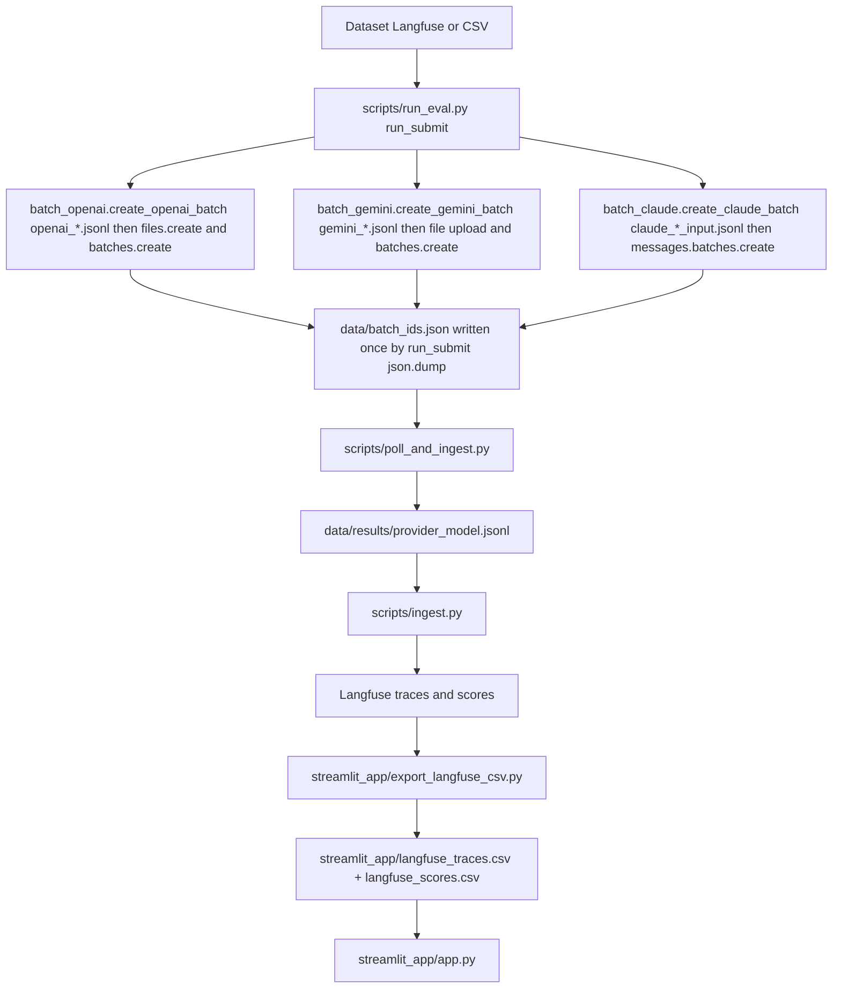

# Model drift & quality monitoring

Batch-based evaluation across **OpenAI**, **Gemini**, and **Claude** provider Batch APIs. Loads a fixed eval subset from **Langfuse** (or a local CSV), submits asynchronous batch jobs, downloads raw JSONL results, **ingests traces and scores into Langfuse**, and optionally serves a **Streamlit** dashboard from committed CSV snapshots.

---

## Repository overview

| Stage | What happens |
|-------|----------------|
| **Dataset** | Rows with `custom_id`, canonical request `body`, and label `campaign_relevant` — from Langfuse or CSV. |
| **Submit** | `run_eval.py` → **`run_submit()`** loops models and calls **`create_openai_batch` / `create_gemini_batch` / `create_claude_batch`** (in `batch_*.py`): each writes JSONL under `batches/`, submits via provider SDK, returns an id; **`run_submit`** then **`json.dump`s `data/batch_ids.json`**. |
| **Retrieve** | `poll_and_ingest.py` polls until jobs finish (or timeout), downloads to `data/results/*.jsonl`. |
| **Ingest** | `ingest.py` parses predictions, compares to ground truth, writes Langfuse traces/spans/generations and scores. |
| **Dashboard** | `export_langfuse_csv.py` pulls traces/scores from Langfuse public API into CSVs; `streamlit_app/app.py` reads those CSVs (default path). |

### Pipeline (high level)

**Load data:** `run_eval.py` calls **`run_submit()`**, which uses **`scripts/lib/load_dataset.py`** + **`config/request_template.json`**. If any **Gemini** model is in the run, **`ensure_images_uploaded()`** in **`scripts/lib/upload_gemini_images.py`** runs first (Gemini batch needs Files API URIs for images).

**Submit (where JSONL is created, where batches are sent, where `batch_ids.json` comes from):**

| Step | File | Function | What it does |
|------|------|----------|--------------|
| Orchestrate | **`scripts/run_eval.py`** | **`run_submit()`** | Loads rows, loops `config/models.yaml` models, dispatches to the right provider; **only place that writes `data/batch_ids.json`** (`json.dump` of `run_id`, `subset_size`, `batches[]`). |
| OpenAI | **`scripts/batch_openai.py`** | **`create_openai_batch(model, examples, …)`** | Writes **`batches/openai_{model}.jsonl`** (`POST /v1/responses` lines) → **`files.create`** → **`batches.create`** → returns **batch id**. |
| Gemini | **`scripts/batch_gemini.py`** | **`create_gemini_batch(model, examples, …)`** | Writes **`batches/gemini_{model}.jsonl`** (native request JSON) → **`files.upload`** → **`batches.create`** → returns **job name/id**. |
| Claude | **`scripts/batch_claude.py`** | **`create_claude_batch(model, examples, …)`** | Writes **`batches/claude_{model}_input.jsonl`** (staging), builds Anthropic requests in memory → **`messages.batches.create`** → returns **batch id**. |

Each `create_*` return value is appended to `batch_ids` in **`run_submit`**; the manifest file is written **once** after all models are processed.

**Downstream:** **`poll_and_ingest.py`** reads **`data/batch_ids.json`**, polls/downloads **`data/results/{provider}_{model}.jsonl`**, calls **`ingest.py`** per file. **`export_langfuse_csv.py`** hits Langfuse **HTTP API**; the app reads **`streamlit_app/langfuse_*.csv`**.



---

## Prerequisites

- **Python**: 3.11+ (GitHub Actions use 3.11).
- From repo root:

```bash
pip install -r requirements.txt
```

- Create a **`.env`** at project root with the variables below.

---

## Environment variables

| Variable | Used by | Purpose |
|----------|---------|---------|
| `OPENAI_API_KEY` | `batch_openai.py`, `run_eval.py`, `poll_and_ingest.py` | OpenAI Batch API |
| `GOOGLE_API_KEY` (or `GOOGLE_GENAI_API_KEY` / `GEMINI_API_KEY`) | `batch_gemini.py`, `upload_gemini_images.py` | Gemini Batch + Files API |
| `ANTHROPIC_API_KEY` | `batch_claude.py`, `run_eval.py`, `poll_and_ingest.py` | Anthropic Message Batches |
| `LANGFUSE_PUBLIC_KEY` | `sync_dataset.py`, `ingest.py`, `export_langfuse_csv.py`, Streamlit | Langfuse project (public key) |
| `LANGFUSE_SECRET_KEY` | same | Langfuse secret key |
| `LANGFUSE_HOST` or `LANGFUSE_BASE_URL` | optional | Self-hosted Langfuse URL (default cloud in export/app) |
| `LANGFUSE_DATASET_NAME` | optional | Override default Langfuse dataset name when not passed on CLI |
| `RUN_ID` | optional | Tag traces/metadata (CI sets `gha-<run_id>`) |

 For **GitHub Actions**, stored as repository secrets
 
 `STREAMLIT_SYNC_TOKEN` — PAT for pushing to the private dashboard repo (see [Sync dashboard workflow](#github-actions-workflows)).

---

## Repository layout

| Path | Role |
|------|------|
| `scripts/` | CLI entrypoints: `run_eval.py`, `poll_and_ingest.py`, `ingest.py`, `sync_dataset.py`; provider modules `batch_*.py` |
| `scripts/lib/` | Helpers: `load_dataset.py`, `upload_gemini_images.py`, `image_cache.py` (not usually run standalone) |
| `config/models.yaml` | Model lists per provider + **batch** pricing (`pricing:`) for USD cost scores |
| `config/request_template.json` | Default OpenAI-style request template merged with Langfuse row `input` |
| `batches/` | Generated JSONL batch inputs (OpenAI/Gemini/Claude) |
| `data/batch_ids.json` | Run manifest: `run_id`, `subset_size`, per-model `batch_id` / errors |
| `data/results/` | Downloaded batch output JSONL per provider+model |
| `data/gemini_image_cache.json` | URL → Gemini Files API URI (with TTL) |
| `input/` | Example CSV layout for local runs (`dataset.csv` if used) |
| `streamlit_app/` | `app.py`, `export_langfuse_csv.py`, committed `langfuse_*.csv` snapshots |
| `.github/workflows/` | Weekly submit, retrieve/ingest, dashboard sync |

---

## Dataset source

### Default: Langfuse

- `load_dataset.py` loads items via `Langfuse().get_dataset(name)`.
- **Default dataset name** in code: `campaign_relevance_disagree_subset_9d488308aa46` — override with `--langfuse-dataset <name>` or `LANGFUSE_DATASET_NAME`.
- Each item is merged with `config/request_template.json` (or first row of template CSV / fallbacks) into a canonical `body` with multimodal `input`.

### Local CSV

- Pass `--csv path/to.csv` to `run_eval.py` and `poll_and_ingest.py` (and optionally `upload_gemini_images` via its CLI).
- Expected columns include `custom_id`, Python-literal `body`, `campaign_relevant`.

### Upload CSV → Langfuse (versioned dataset)

Creates `"{name}_{sha256[:12]}"` if it does not already exist:

```bash
python scripts/sync_dataset.py --csv input/dataset.csv --name campaign_relevance
```

Requires `LANGFUSE_PUBLIC_KEY` and `LANGFUSE_SECRET_KEY`.

---

## Step-by-step (local, from repo root)

### 1. Install and env

```bash
pip install -r requirements.txt
# .env: OPENAI_API_KEY, GOOGLE_API_KEY, ANTHROPIC_API_KEY, LANGFUSE_PUBLIC_KEY, LANGFUSE_SECRET_KEY
```

### 2. Configure models

Edit **`config/models.yaml`**: lists under `openai`, `gemini`, `claude`. Pricing under `pricing:` drives **`cost_usd`** in Langfuse (per 1M tokens, batch rates).

### 3. Submit batches

```bash
python scripts/run_eval.py --langfuse-dataset YOUR_DATASET_NAME --batch-ids data/batch_ids.json --run-id my-run-001
```

- Loads all examples from the dataset (or use `--csv ...`).
- Clears **`data/results/`** at start of submit.
- If any **Gemini** model is selected, runs **`ensure_images_uploaded`** (uploads image URLs to Gemini Files API, updates `data/gemini_image_cache.json`).
- Writes **`data/batch_ids.json`**: `run_id`, `subset_size`, `batches[]` with `model`, `provider`, `batch_id` (or `error`).
- Writes provider inputs under **`batches/`** (e.g. `openai_<model>.jsonl`, `gemini_<model>.jsonl`, `claude_<model>_input.jsonl`).

Optional: `--models comma,separated` to restrict models.

### 4. Poll, download, ingest

After batches complete (minutes to hours):

```bash
python scripts/poll_and_ingest.py --batch-ids data/batch_ids.json --run-id my-run-001
```

- Polls provider status (default interval **300 s** locally; CI uses `--interval 60 --max-wait 3600`).
- Downloads completed jobs to **`data/results/{provider}_{model}.jsonl`**.
- Skips failed/cancelled/expired; default loop may not wait forever — see **`--wait-for-all`** for long runs.
- For each existing result file, calls **`ingest_results`** → Langfuse traces + scores.

Ground truth for scoring: same as submit — use `--langfuse-dataset` or `--csv` consistently (see `poll_and_ingest.py` CLI: `--langfuse-dataset` vs `--csv`).

### 5. Export CSV snapshots (for Streamlit / offline)

```bash
python streamlit_app/export_langfuse_csv.py
```

- Uses Langfuse **public** HTTP API (`/api/public/traces`, `/api/public/v2/scores`) with Basic auth.
- Time window is **hardcoded** in the script (start date through “now”); adjust the file if you need a different window.
- Writes **`streamlit_app/langfuse_traces.csv`** and **`streamlit_app/langfuse_scores.csv`** (column subset used by the app).

### 6. Run Streamlit locally

```bash
streamlit run streamlit_app/app.py
```

From repo root; app loads CSVs from `streamlit_app/` and optional live Langfuse/OAuth — see [`streamlit_app/README.md`](streamlit_app/README.md).

**Hosted dashboard (example):** https://llm-eval-dashboard.streamlit.app/

---

## GitHub Actions workflows

> **Naming note:** `weekly_drift_monitoring.yml` runs **submit batches** (Friday). The **retrieve** job is `weekly_retrieve.yml`. Names in YAML comments may say “Saturday/Sunday”; **cron** is **Friday 05:00 UTC** submit and **Monday 05:00 UTC** retrieve.

| Workflow file | Schedule / trigger | What it does |
|----------------|-------------------|--------------|
| [`.github/workflows/weekly_drift_monitoring.yml`](.github/workflows/weekly_drift_monitoring.yml) | `cron: 0 5 * * 5` (Fri 05:00 UTC), `workflow_dispatch` | Checkout, `pip install`, `python scripts/run_eval.py --batch-ids data/batch_ids.json --run-id gha-$RUN_ID`, **cache** `data/batch_ids.json` as `weekly-batch-ids-<run_id>`, **upload artifact** `batch_ids`. |
| [`.github/workflows/weekly_retrieve.yml`](.github/workflows/weekly_retrieve.yml) | `cron: 0 5 * * 1` (Mon 05:00 UTC), `workflow_dispatch` | **Restore** cache key `weekly-batch-ids-*`, run `poll_and_ingest.py --interval 60 --max-wait 3600 --run-id gha-$RUN_ID`. |
| [`.github/workflows/sync-streamlit-dashboard.yml`](.github/workflows/sync-streamlit-dashboard.yml) | Mon 07:00 UTC; also on **push to `main`** changing `streamlit_app/**`; `workflow_dispatch` | `export_langfuse_csv.py`, commit CSVs to this repo, **rsync** `streamlit_app/` to `GeorgiiBurdinComo/llm-eval-dashboard` using `STREAMLIT_SYNC_TOKEN`. |

Submit and retrieve share batch IDs via **Actions cache** (not the same run id — restore uses prefix `weekly-batch-ids-`).

---

## Scripts reference

### Entrypoints

| Script | Purpose |
|--------|---------|
| **`scripts/run_eval.py`** | Orchestrator: load dataset (`load_dataset`), optional Gemini image upload, create batches per model (`batch_openai` / `batch_gemini` / `batch_claude`), write `data/batch_ids.json`, clear `data/results/`. |
| **`scripts/poll_and_ingest.py`** | Read `batch_ids.json`, poll providers, download JSONL to `data/results/`, call `ingest.ingest_results` per file. |
| **`scripts/ingest.py`** | Parse each JSONL line per provider, extract `campaign_relevant`, join ground truth, write Langfuse trace/span/generation, attach scores. Can be run alone for a single file: `ingest.py <jsonl> --model ... --provider ...`. |
| **`scripts/sync_dataset.py`** | Upload CSV rows to a versioned Langfuse dataset name. |

### Provider adapters (used by `run_eval` / `poll_and_ingest`)

| Script | Purpose |
|--------|---------|
| **`scripts/batch_openai.py`** | Build JSONL for `POST /v1/responses`, upload file, create OpenAI batch; status + download. |
| **`scripts/batch_gemini.py`** | Convert to Gemini native batch JSONL, map image URLs from cache to `fileUri`, create Gemini batch job; status + download. |
| **`scripts/batch_claude.py`** | Convert Responses-style `body` to Anthropic messages, sanitize `custom_id`, create message batch; download + remap IDs using staged input JSONL when needed. |

### Helpers (`scripts/lib/`)

| Module | Purpose |
|--------|---------|
| **`load_dataset.py`** | Langfuse or CSV → `{custom_id, body, campaign_relevant}`; merges `request_template.json`. |
| **`upload_gemini_images.py`** | Download image URLs, upload to Gemini Files API, persist `data/gemini_image_cache.json`. |
| **`image_cache.py`** | Load/save cache; TTL checks for Gemini file handles. |

### Notebooks (ad-hoc)

- `scripts/retrieve.ipynb` — debug polling / batch status.
- `scripts/statistics.ipynb` — Langfuse API pulls, paired metrics.
- `scripts/GEPA.ipynb` — prompt optimization experiments (if present).
- `streamlit_app/accuracies.ipynb` — metrics exports under `streamlit_app/metrics_export/` (thesis/LaTeX), not the core runtime path.

---

## Results and artifacts

| Artifact | Produced by | Contents |
|----------|-------------|----------|
| `batches/*.jsonl` | `batch_*.py` | Provider-specific batch **inputs** |
| `data/batch_ids.json` | `run_eval.py` | `run_id`, `subset_size`, per-model `batch_id` / `error` |
| `data/results/{provider}_{model}.jsonl` | `poll_and_ingest.py` | Raw batch **outputs** (one file per successful download) |
| `data/gemini_image_cache.json` | `upload_gemini_images` | URL → Gemini file URI + metadata |
| Langfuse UI | `ingest.py` | Traces, generations, scores |
| `streamlit_app/langfuse_traces.csv` | `export_langfuse_csv.py` | Flattened trace rows (selected columns) |
| `streamlit_app/langfuse_scores.csv` | `export_langfuse_csv.py` | Flattened score rows |
| `streamlit_app/metrics_export/*` | notebooks | Optional wide/long tables and LaTeX fragments |

---

## How traces and scores are computed (`ingest.py`)

1. **Ground truth**  
   - Langfuse dataset: `expected_output.campaign_relevant` per `custom_id` (from dataset item metadata/input).  
   - Or CSV: `campaign_relevant` column keyed by `custom_id`.

2. **Prediction**  
   - Provider-specific parsing from batch response JSON: OpenAI `output` / `body`, Claude `content` text JSON, Gemini `candidates` text JSON — field **`campaign_relevant`** (boolean).

3. **Scores written to Langfuse** (on the span / observation)  
   - **`accuracy`**: numeric `1.0` / `0.0` vs ground truth.  
   - **`error_type`**: categorical — `true_positive`, `false_positive`, `true_negative`, `false_negative`.  
   - **`cost_usd`**: from `config/models.yaml` **`pricing`** × normalized input/output token counts (per 1M tokens).

4. **Trace metadata**  
   - Tags like `batch_evaluation`, `model:<name>`, `run:<run_id>` when `run_id` is set.

Token usage is normalized per provider (`_normalize_usage`); Gemini may include “thinking” tokens in output side.

---

## Troubleshooting

- **`batch_ids.json` missing in CI retrieve** — Cache restore can fail if submit did not run or key prefix mismatch; re-run submit workflow or use `workflow_dispatch` with a known good cache.
- **Gemini image errors** — Run `upload_gemini_images` / ensure cache is fresh; TTL ~47h; `batch_gemini` may skip rows with missing URIs.
- **Poll finishes without all models** — Check `data/results/` which files exist; failed batches are skipped. Use `--wait-for-all` and tune `--max-wait` / `--interval`.
- **Export empty or short window** — `export_langfuse_csv.py` uses a fixed start timestamp; edit the script to widen the range.
- **Default Langfuse dataset** — If you forget `--langfuse-dataset`, code falls back to `DEFAULT_LANGFUSE_DATASET` in `load_dataset.py` — confirm that matches your project.

---

## Quick reference

```bash
pip install -r requirements.txt

# Optional: push CSV to Langfuse
python scripts/sync_dataset.py --csv input/dataset.csv --name campaign_relevance

# Submit
python scripts/run_eval.py --langfuse-dataset YOUR_DATASET --batch-ids data/batch_ids.json --run-id local-001

# After batches complete
python scripts/poll_and_ingest.py --batch-ids data/batch_ids.json --run-id local-001

# Dashboard CSVs
python streamlit_app/export_langfuse_csv.py
streamlit run streamlit_app/app.py
```
