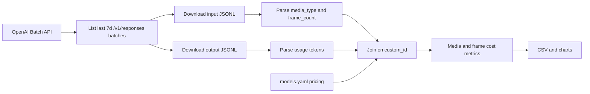

# OpenAI Batch Cost Analysis (GPT-5-mini)

Goal: estimate **GPT-5-mini Batch API spend over the last 7 days** and break it down by content format (text-only / image / video frames). Output is reusable to forecast cost per content piece, per influencer/day, and per campaign/day.

## Source of truth

- **API**: OpenAI Batch API (`/v1/batches`, `/v1/files/{id}/content`) using `OPENAI_API_KEY`.
- **Endpoint scope**: `/v1/responses` batches only.
- **Model scope**: `gpt-5-mini` (filter on the model field of each input row).
- **Time window**: `created_at >= now_utc − 7 days`.
- **Unit of analysis**: one request line, joined by `custom_id` between input JSONL and output JSONL.
- **Pricing**: read from [`config/models.yaml`](config/models.yaml) →
  - input: `0.125 USD / 1M tokens`
  - output: `1.00 USD / 1M tokens`
- **Cost formula**:
  - `input_cost  = input_tokens  / 1_000_000 * 0.125`
  - `output_cost = output_tokens / 1_000_000 * 1.00`
  - `total_cost  = input_cost + output_cost`

## Metrics

### Overall (last 7 days)
- total batches, total requests, completed, failed
- total `input_tokens`, `output_tokens`, `total_tokens`
- total USD cost, mean cost/request, p50 / p90 / p95 cost/request
- input/output token ratio
- failed-output rate, retries (duplicate `custom_id`)

### Media split (per request)
Classify each request from its `body.input` content blocks:

| media_type     | rule |
|----------------|------|
| `text_only`    | only `input_text` blocks |
| `image_only`   | only `input_image` blocks |
| `image_text`   | mix of text + 1 image |
| `video_frames` | text + ≥2 image blocks (sampled frames) |
| `unknown`      | nothing matched |

For each bucket: requests, mean/p50/p95 input tokens, output tokens, cost/request, total cost, share of weekly spend.

### Video / frame metrics
Bucket by frame count: `1`, `2-3`, `4-6`, `7-10`, `10+`.
- mean `input_tokens` per bucket
- mean total cost per bucket
- marginal input tokens per extra frame (linreg `input_tokens ~ frame_count`)
- correlation `frame_count` vs `input_tokens`

### Top-N drill-down
- top 20 most expensive requests (with `custom_id`, `media_type`, `frame_count`, tokens, cost)
- top batches by total spend

### Forecast
- `cost_per_content = mean(total_cost)` overall and per `media_type`
- `cost_per_influencer_per_day = posts_per_day × cost_per_content`
- `cost_per_campaign_per_day   = influencers_per_campaign × cost_per_influencer_per_day`
- scenario table: low / base / high posts/day × p50 / p95 cost/content

## Notebook workflow

Notebook: [`notebooks/openai_batch_cost_analysis.ipynb`](notebooks/openai_batch_cost_analysis.ipynb)

1. **Setup**: load `.env`, init `OpenAI()` client, load pricing from `config/models.yaml`.
2. **List batches**: paginate `client.batches.list(limit=100)`, keep `endpoint == "/v1/responses"` and `created_at >= now − 7d`.
3. **Download raw files**: for each batch save `input.jsonl` and `output.jsonl` under `data/openai_cost_analysis/raw/<batch_id>/`. Skip `error_file_id` when missing. Cache on disk so reruns are free.
4. **Parse inputs**: per line extract `custom_id`, `body.model`, count `input_text` and `input_image` blocks; derive `media_type` and `frame_count`. Keep only rows where model starts with `gpt-5-mini`.
5. **Parse outputs**: per line extract `custom_id`, response status, `usage.input_tokens`, `usage.output_tokens`, `usage.total_tokens` (mirrors logic in [`scripts/ingest.py`](scripts/ingest.py)).
6. **Join + cost**: left join input→output on `custom_id`, compute `input_cost`, `output_cost`, `total_cost`.
7. **Aggregate**: build summary tables — overall, by `media_type`, by `frame_bucket`, by `batch_id`.
8. **Charts**: cost share by `media_type` (pie/bar), input tokens vs `frame_count` (scatter+fit), distribution of `total_cost` per request (hist).
9. **Exports**:
   - `data/openai_cost_analysis/joined_last_7d.csv`
   - `data/openai_cost_analysis/summary_by_media.csv`
   - `data/openai_cost_analysis/summary_by_frame_bucket.csv`
   - PNG charts under `notebooks/openai_cost_analysis_charts/`
10. **Interpretation**: short markdown cell — what drives weekly spend and a forecast for influencer/day and campaign/day.

## Data flow

## Assumptions

- Model is `gpt-5-mini`; pricing comes from `config/models.yaml` (Batch API rates).
- Video posts are represented as text + multiple `input_image` blocks (sampled frames). If a request has no clear video markers, it stays in `image_only` / `image_text` rather than being guessed.
- Image tokens are already included in `usage.input_tokens` returned by the Responses API, so no separate image-token estimation is needed.
- The notebook only reads OpenAI batch artifacts reachable via `OPENAI_API_KEY`; no tenant/revenue data is joined in this first pass.
